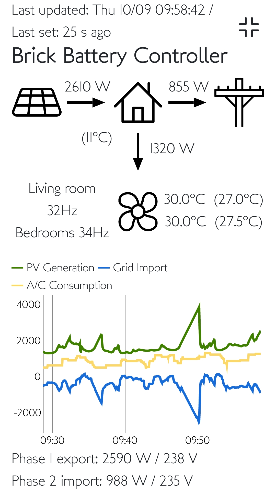
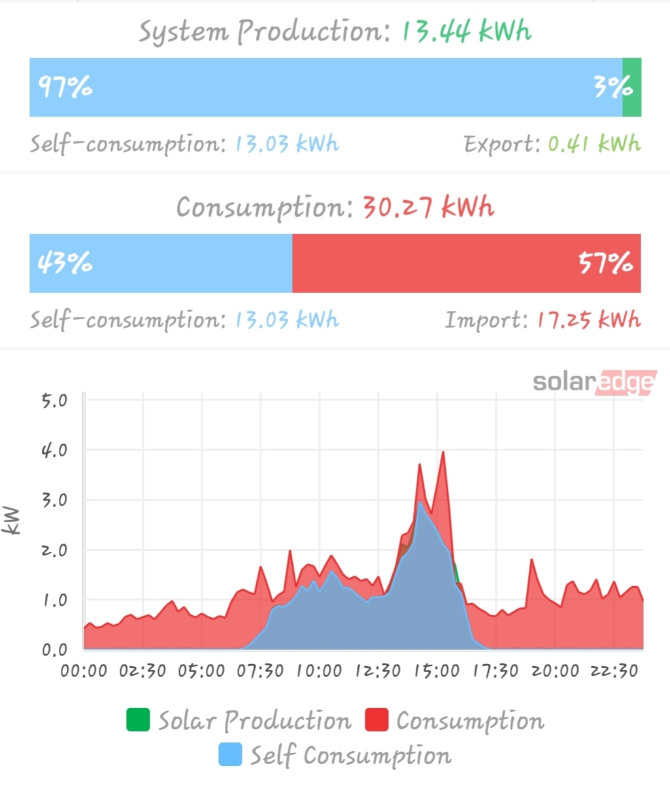

# Brick Battery

## Quick description

A piece of Python software to run heating harder at home when the sun
shines, charging up bricks with heat.

It runs Python for the controller and comes with a mobile friendly Web UI in Javascript for the monitoring and configuration.

It helps achieve greater PV self-consumption and import less when grid power is more expensive in the evening, as shown below on the daily values graph:

## Some software specs

- Tested on Python3.12
- Implements a client for the SolarEdge API (to get power of inverter and grid
net meter)
- Implements a ModBus TCP SunSpec client as an alternative more reliable way to
poll the inverter from the LAN
- Implements a client for the Daikin API to monitor and control A/C units
- Runs a poll loop every 3 seconds to check grid import/export
and aircon consumptions
- Adjusts every preset interval if needed the aircon control settings to
get the grid import/export value fall within the pre-defined target.
This gives enough time for the aircon compressors
to adjust their running regime.
- Logs sensors and controls to know what is going on during the system operation
- Has a sleep mode setting for the aircons to operate in when PV generation has
stopped for the day
- Polls all APIs asynchronously (concurrently)
- Provides its own API used by the web UI to monitor usage and configure settings

## The physical setup:
- Canberra climate: cold winters but sunny and relatively warm days with cool
nights
- About 5kW of PV generation in a split array using a SolarEdge HD Wave inverter
connected to a WattMeter for the grid net consumption monitoring. This roughly
provides a 3kW peak of alternative current generation in the middle of a sunny
winter day.
- 2x Daikin Ururu Sarara 3.5kW (FTXZ-N 35) split air conditioners each connected
to a Daikin wifi module. These fancy aircons run a humidifier but Daikin
"forgot" to advertise the fan speed settings through the LAN API controller
- A Raspberry Pi 3 running Debian
- 3-phase grid supply, 1-phase inverter

## Background

This program helps with a problem I faced setting up home automation.
I installed rooftop solar generation and wanted to maximise my self-consumption
to avoid selling cheaply electricity during the day only to have to buy it back
at a higher price later during the night, hence the battery side of things.
But electric batteries are still a bit expensive (at least in 2019).

This is particularly prevalent in winter when PV generation is limited but
heating needs are high.
Luckily I have the following playing on my side:
- Can monitor in real-time instantaneous power of PV generation and grid
import/export
- Can command settings and quite accurately estimate power consumption of the
2 inverter-based air-conditioning systems used to heat up the house
- The house itself has a high thermal mass as all the inner walls are made of
solid brick

Here we have all the ingredients to create an energy storage system using the
most degraded form of energy: heat! (and the name to the new project)

In the utility industry this system is commonly referred to as an active
Distributed Energy Resources or active DER. From the grid point-of-view, the
system helps by storing energy instead of releasing it to the grid when all the
neighbours are at work and their houses are not consuming much (this is not so
much of a problem yet with current penetration rate of PV generation) and most
importantly avoiding the extra consumption in evening during the peak hour
demand.
Obviously, my main consideration here is more, as stated earlier, to minimise
my energy bill by increasing my self-consumption (and have a bit of fun
designing the system).

The system was initially polling the SolarEdge cloud API but after I found it
not always reliable and sometimes too laggy (>2/3min between refreshes), I
found that I could fairly simply use the ModBus over TCP capability from the
inverter and get all data from the LAN. This uses the SunSpec standard so it
should be easy to use with any non-SolarEdge inverter.

## User interface

See the <a href="ui/readme.md">UI Readme page</a> for the A/C remote and BBC
remote using simple Javascript web applications.
