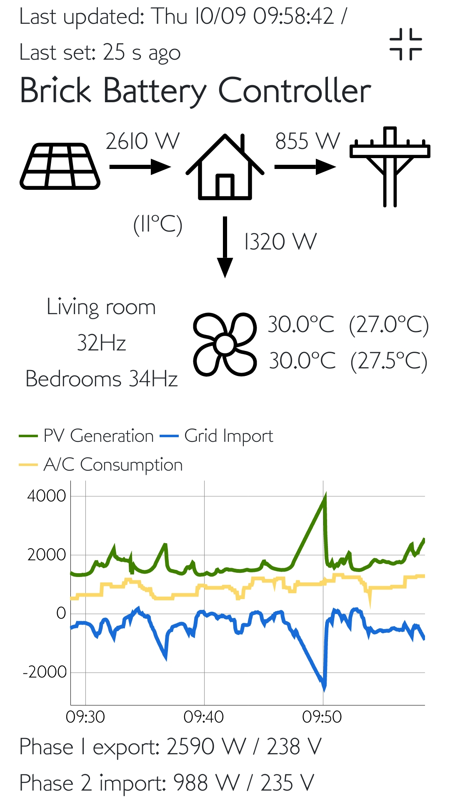

# Web UI applications

Both Web controllers use a simple light design to control the endpoints
directly using Javascript. They are implemented using Vue.js, with a 
Bootstrap layout. The control sliders of the BBC remote are made using the nice
Ion Range Slider that unfortunately, in the v2.3.0, pulls down the jQuery
library with it :(

## A/C remote

This remote is actually independent of the Brick Battery controller.
You can simply use it on its own if you like the interface to control
your Daikin units from your phone at home. It even tells you the estimated
instant consumption of the aircon units.
Edit `ac-remote.js` and edit the aircons to be displayed and controlled
through the wifi controller unit.
The only requirement is that the web server serving the resources, also
proxies the access to the wifi units, otherwise calls are blocked for
breaking same-site policy.

This version currently does not have any fan speed settings as the Ururu
units I have do not support setting them via wifi (thanks Daikin).

## Brick Battery Controller remote

This remote can change almost all the settings of the Python controller once the
initial setup has been done. As for A/C remote, the same host:port needs to be
used to serve both the Web app and the BBC API endpoint to avoid cross-site
scripting issues. A local proxy in front of the Python BBC API is a simple way
to achieve that.
Then just edit `bbc.js` to enter the proxy endpoint.

